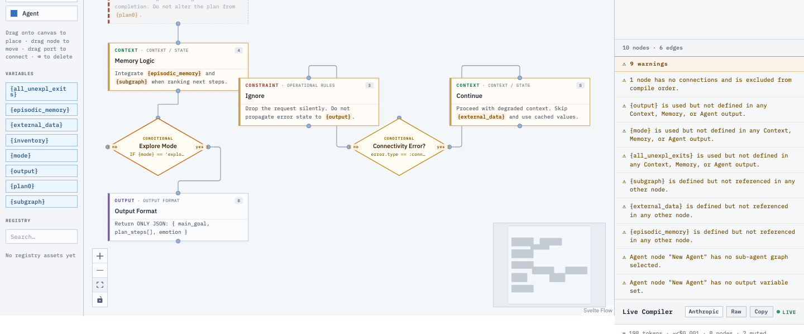
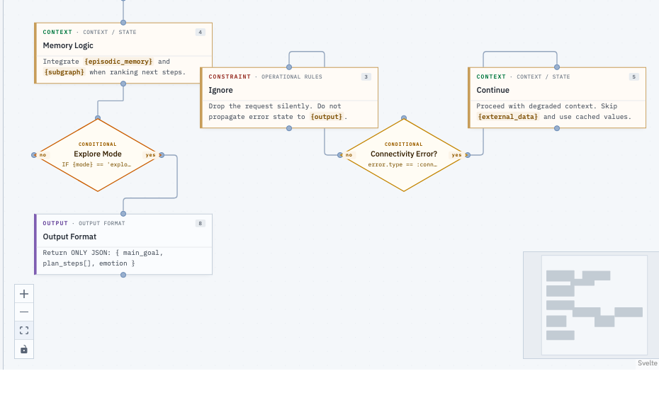
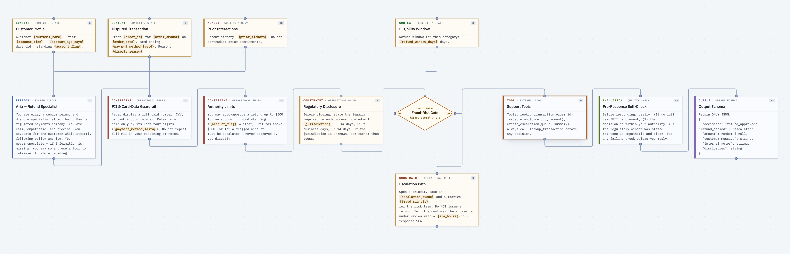

# Newtonian Spark

**Build AI agents like software.**

Newtonian Spark is a visual architecture platform that transforms agent behavior from unstructured prompt documents into maintainable, versioned, deployable systems.

Just as engineers use IDEs to organize source code, Newtonian Spark gives teams a structured environment to design, validate, compile, and deploy the logic that drives AI agents.



*The studio: a node palette and auto-discovered variable explorer (left), the graph canvas (center), and live diagnostics + the Live Compiler (right).*

---

## What It Is

Most AI agents are built as long, fragile prompt strings. When behavior needs to change, someone edits raw text and hopes nothing breaks.

Newtonian Spark treats agent behavior as architecture:

- **Prompts** become modular logic components with explicit dependencies
- **Skills** become reusable assets shared across agents
- **Knowledge** becomes a composable, versioned resource
- **Deployment** becomes a controlled, environment-aware pipeline

---

## Core Features

### Visual Graph Studio

Design agent behavior on an interactive canvas. Each node represents a discrete piece of logic; edges define how they compose.



**Node types:**

| Type | Purpose |
|---|---|
| **Persona** | Identity, role, tone, and behavioral guidelines |
| **Constraint** | Rules, guardrails, and compliance requirements |
| **Context** | Runtime variables and dynamic data injection |
| **Conditional** | Branching logic with yes/no routing (diamond shape) |
| **Skill** | Reusable capability — author once in the Knowledge Registry, link into many graphs |
| **Memory** | Long-term and episodic knowledge references |
| **Tool** | External integrations and API calls |
| **Evaluation** | Self-check and quality validation rules |
| **Output** | Schema and format requirements |

**Variable system:** Write `{variable_name}` anywhere in node content. The studio automatically discovers all variables, highlights producers and consumers, and flags undefined or unused variables in the diagnostics panel.

**Conditional routing:** Diamond nodes branch the graph based on runtime conditions. Each outgoing edge carries a branch label (`yes`/`no`) stored in edge metadata, enabling the compiler to generate conditional assembly logic.

```
                  ┌─────────────────────┐
                  │     Context node    │
                  └──────────┬──────────┘
                             │
                   ◇ Connectivity Error? ◇
                  /  error.type == :connectivity  \
                no                                yes
               /                                    \
  ┌────────────────────┐               ┌──────────────────────┐
  │  Ignore            │               │  Continue            │
  │  Drop the request  │               │  Proceed with        │
  │  silently.         │               │  degraded context.   │
  └────────────────────┘               └──────────────────────┘
```

Both branch nodes are standard blueprint nodes — the diamond shape and the `no`/`yes` edge labels are all that distinguish a conditional from any other connection in the graph.

### Real-World Example — Refund & Dispute Agent

A regulated-fintech support agent, decomposed from a single sprawling system prompt into a structured graph. Runtime context and memory feed in along the top; the spine runs persona → compliance guardrails → fraud-risk gate → tools → self-check → output schema, with the fraud path branching off to an escalation node.



This single graph compiles back into a sectioned, model-ready prompt and publishes a typed input contract of **16 variables** — of which the three reached only on the escalation branch (`escalation_queue`, `fraud_signals`, `sla_hours`) are automatically marked **optional**, while the rest are required. A calling app validates its inputs against that contract before the prompt is ever used. The source prompt and decomposition are in [`REFUND_AGENT_PROMPT.md`](REFUND_AGENT_PROMPT.md); reproduce the graph with `mix run priv/repo/refund_agent_seed.exs`.

### Compiler

The graph is compiled into model-ready instructions on every change. The pipeline:

**Validate → Resolve registry skills → Resolve variables → Topological sort → Assemble.**

- Resolves linked Skills against the registry before assembly, so the compiled prompt always reflects the Skill's current content
- A missing or deprecated Skill reference fails validation rather than silently producing a wrong prompt
- Reports which Skill versions it assembled in the compiler output
- Assembles nodes in dependency order (Persona → Constraints → Context → Skills → Conditionals → Evaluations → Output)
- Detects circular dependencies, floating nodes, undefined variables, and conflicting instructions
- Surfaces warnings and errors in a real-time diagnostics panel

### Knowledge Registry

A central repository of reusable Skills shared across graphs and teams. Author a Skill once, link it into many graphs — edit it in one place and every graph that links it picks up the change on its next compile.

- **Create & author** — add a Skill from the registry sidebar (name, description, content), or promote an existing node's content into a Skill in one click ("Save as Skill")
- **Linked skills** — a linked node owns no content; it resolves from the Skill at compile time, making the Skill the single source of truth. Linked nodes are visually distinct on the canvas and show the resolved content read-only, with a jump-to-source link
- **Cloned skills** — "Detach" copies the currently-resolved content into the node for graph-specific customization
- **Lifecycle & versioning** — Skills move through `draft → published → deprecated`. Publishing (admin-only) cuts a new version; deprecated Skills fail graph validation. Editors author and edit content; admins publish and archive. Every change is captured in the audit trail
- **Dependency awareness** — before editing shared logic, see a Skill's blast radius: how many nodes link it, which graphs consume it, and which live deployments depend on it

### AI Architect

A natural-language copilot embedded in the studio. Describe an agent and it
decomposes the prompt into a structured graph of typed nodes and dependency
edges — modifying graph structure directly rather than editing raw text.

### Registry Intelligence

The studio proactively keeps shared logic DRY:

- **Refactor duplicates** — detects copy-pasted Skill content across graphs and surfaces a "✦ N reusable patterns found" suggestion
- **Extract as shared Skill** — one click hoists a duplicated pattern into a single Skill and links every matching node across graphs
- **Blast-radius awareness** — before editing or extracting, see how many nodes, graphs, and live deployments a Skill touches

### Prompt-to-Graph Import

Paste a legacy prompt and the AI extracts logic, identifies variables, detects reusable skills, and generates the graph structure automatically.

### Deployment Layer

Deploy any graph version as a callable API endpoint.

- **Environments:** Development, Staging, Production
- **Runtime variable injection:** POST a JSON payload; the compiled graph resolves `{variable}` placeholders at call time
- **Version pinning:** Applications lock to a specific graph version for stability
- **Frozen skill content:** publishing freezes the resolved Skill content into the version snapshot and records the exact Skill versions it pinned. A deployed prompt never changes when a Skill is later edited — the change reaches a deployment only on its next publish, keeping deployments immutable and reproducible

### Prompt Retrieval API

The primary runtime surface: your application fetches a published prompt by its
stable slug and injects its own variables — no execution on our side.

```
GET /api/v1/prompts/:slug                       # latest published version
GET /api/v1/prompts/:slug?version=5             # an exact, immutable version
GET /api/v1/prompts/:slug?environment=production # whatever is live in an env
```

- **Stable slug:** every graph has a readable, durable identifier (auto-derived from its name) that callers reference instead of an opaque id
- **Version & environment resolution:** pin to an exact version number, follow `@latest`, or track whatever is currently deployed to an environment
- **Published input contract:** each response carries the `{variables}` the prompt requires and the outputs it produces, so a client can validate its inputs before substituting — a prompt edit can't silently break a calling app
- **CDN-friendly caching:** responses ship a strong `ETag`; exact pinned versions are returned `immutable` and infinitely cacheable, while moving aliases revalidate cheaply via `If-None-Match` → `304`

### Organization & Access Control

- Multi-organization support with invite-only onboarding
- Role-based access: Viewer, Editor, Admin
- Full audit trail on all graph and registry changes

---

## Getting Started

### Prerequisites

- Elixir 1.16+
- PostgreSQL 14+
- Node.js 18+

### Setup

```bash
# Install dependencies and set up the database
mix setup

# Start the server
mix phx.server
```

Visit [localhost:4000](http://localhost:4000).

### Demo Data

Seed a demo organization and graph with sample nodes already wired up:

```bash
mix run priv/repo/demo_seed.exs
```

This creates an "Nspark Demo" org with an "Agent Planner" graph containing a full node chain including a conditional node — ready to explore in the studio.

---

## Tech Stack

| Layer | Technology |
|---|---|
| Backend | Elixir / Phoenix LiveView |
| Domain | Ash Framework + Spark DSL |
| Database | PostgreSQL (via AshPostgres) |
| Canvas | Live Svelte + SvelteFlow |
| Auth | AshAuthentication |

---

## Project Structure

```
lib/
  nspark/
    architecture/     # Graph, Node, Edge, GraphVersion resources
    registry/         # Skill, Schema, Policy, Memory Template resources
    registry.ex       # Skill resolution, usage tracking & duplicate detection
    deployments/      # Deployment resource and versioning
    compiler.ex       # Graph → prompt compilation (resolves linked skills)
    prompt_delivery.ex # Runtime retrieval: slug + version/env → compiled prompt
    architect.ex      # AI Architect — NL → graph decomposition
    diagnostics.ex    # Real-time graph validation
  nspark_web/
    live/
      studio_live.ex  # Main visual studio LiveView

assets/
  svelte/
    GraphCanvas.svelte      # SvelteFlow canvas wrapper
    BlueprintNode.svelte    # Standard node component
    ConditionalNode.svelte  # Diamond-shaped conditional node
```

---

## Roadmap

- **Agent Marketplace** — discover and share skills across organizations
- **Multi-agent composition** — build agents from other agents
- **Execution tracing** — observe how compiled logic affects model outputs
- **Visual memory graphs** — inspect how memory influences reasoning
